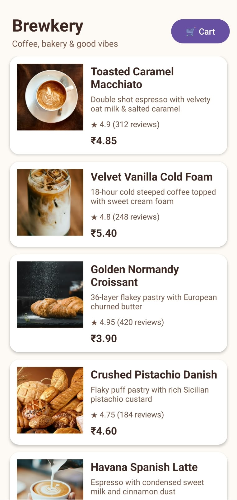
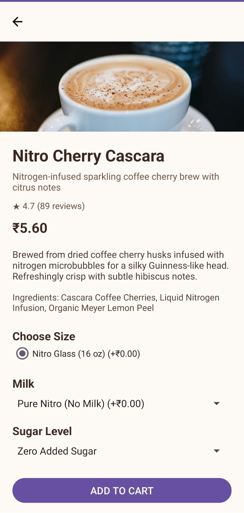
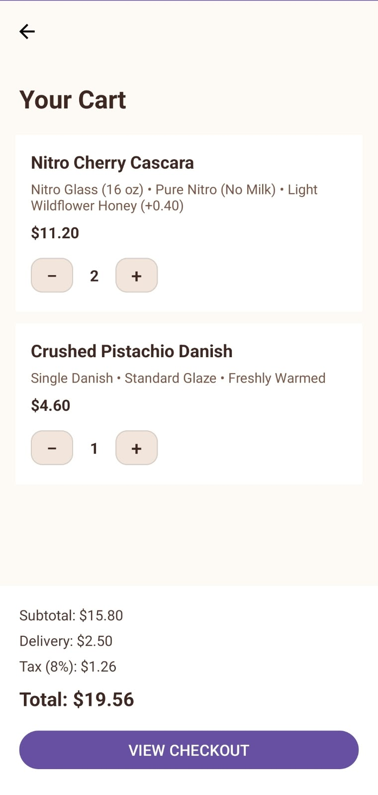
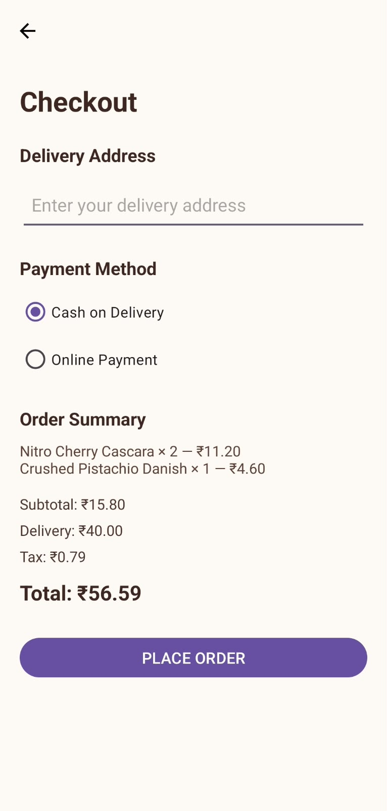
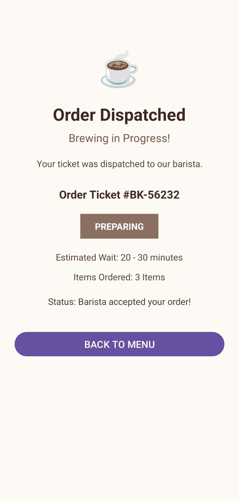

# Brewkery ☕🧁

**Brewkery** is a native Android coffee and bakery ordering application built in Kotlin. It features a clean MVVM architecture, REST API menu fetching with Retrofit and Kotlin Coroutines, Glide for image loading, dynamic cart total updates, and smooth navigation through the ordering workflow.

---

## 📱 Screenshots & Demo

### Screenshots

<table>
  <tr>
    <th>Menu / Home</th>
    <th>Item Detail</th>
    <th>Cart Management</th>
  </tr>
  <tr>
    <td></td>
    <td></td>
    <td></td>
  </tr>
  <tr>
    <th>Checkout</th>
    <th>Order Confirmation</th>
    <th></th>
  </tr>
  <tr>
    <td></td>
    <td></td>
    <td></td>
  </tr>
</table>

### 🎥 Video Demonstration

<video src="screenshots/screen%20recording.mp4" controls width="100%"></video>


https://github.com/user-attachments/assets/4f195dcd-8a48-477a-8b70-545938fbe054


---

## ✨ Features

- ☕ **Browse Menu**: Dynamic list of coffee and bakery items loaded via REST API.
- 🔍 **Item Details**: Detailed views showing descriptions, pricing, and high-resolution images.
- 🛒 **Interactive Cart**: Quantity adjustment (increase/decrease) with real-time recalculation of line-item prices and overall cart total.
- 💳 **Seamless Checkout**: Order summary review and detail submission.
- 🎉 **Order Tracking**: Clear order placement confirmation and status update screen.

---

## 🛠️ Tech Stack & Architecture

- **Language**: [Kotlin](https://kotlinlang.org/)
- **Architecture**: MVVM (Model - View - ViewModel) + Repository Pattern
- **Network**: [Retrofit 2](https://square.github.io/retrofit/) & Gson Converter
- **Asynchronous Execution**: Kotlin Coroutines
- **Image Loading**: [Glide](https://github.com/bumptech/glide)
- **UI Components**: AndroidX, Material Design Components, RecyclerView, ViewBinding

---

## 🤖 AI Usage

AI tools were used throughout the development of this Android application for code assistance, debugging, UI improvements, and troubleshooting.

### AI Tool Used
**ChatGPT (OpenAI)** — Used for Android/Kotlin development assistance, debugging Gradle/XML errors, improving UI layouts, and reviewing implementation logic.

### Example Prompts

#### API & Architecture
> "Build a native Android coffee and bakery ordering app in Kotlin using Retrofit and coroutines. The app should fetch menu items from a REST API and follow a simple MVVM architecture."

#### Cart Functionality
> "Add quantity increase and decrease functionality to the cart. When quantity changes, update the item price and cart total."

#### UI Debugging
> "My Android resource linking failed because insetTop and insetBottom attributes are not found in MaterialButton. Fix this XML error."

---

### What AI Got Right

AI helped successfully implement and troubleshoot several parts of the application, including:
- Retrofit API integration with coroutines.
- MVVM-based structure with Repository and ViewModel.
- Cart quantity management.
- Navigation between Home, Product Detail, Cart, Checkout, and Order Status screens.
- Identifying and fixing Android XML/resource linking errors.

---

### What AI Got Wrong

One issue occurred when AI suggested using:

```xml
app:insetTop="0dp"
app:insetBottom="0dp"
```

on `MaterialButton`. These attributes were not supported by the Material Components version used in the project and caused an Android resource linking error.

---

### How It Was Fixed

I checked the Gradle build error, identified that the unsupported attributes were causing the problem, and removed `app:insetTop` and `app:insetBottom` from both quantity buttons. The project then built successfully.

---

## 🚀 Getting Started

1. **Clone the Repository**:
   ```bash
   git clone https://github.com/keshavbind/Brewkery.git
   ```
2. **Open in Android Studio**:
   Open Android Studio, select **Open an Existing Project**, and choose the `Brewkery` folder.
3. **Build & Run**:
   Sync Gradle and run the app on an Android Emulator or physical device running Android 7.0+ (API 24+).
